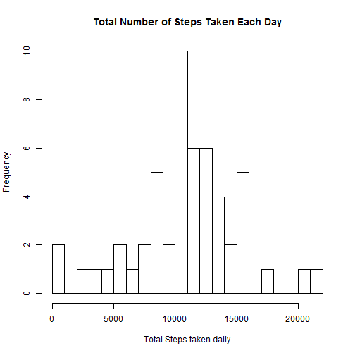

Reproducible  Research : Peer Assessment 1
===========================================

##Loading and preprocessing the data

```r
library(knitr)
opts_chunk$set(echo=TRUE)
```


```r
library(dplyr)
library(ggplot2)
activityData=read.csv("activity.csv")
activityData$date=as.Date(activityData$date,format="%Y-%m-%d")
activityData$stepsNA=is.na(activityData$steps)
activityData_withoutNA=subset(activityData,stepsNA==FALSE)
activityData_withoutNA=activityData_withoutNA[,-4]
activityData_withNA=subset(activityData,stepsNA==TRUE)
activityData_withNA=activityData_withNA[,-4]
```


##What is mean total number of steps taken per day?


```r
grouped_activityData=group_by(activityData_withoutNA,date)
summarized_activityData=summarize(grouped_activityData,steps=sum(steps))
hist(summarized_activityData$steps, breaks=20, main="Total Number of Steps Taken Each Day", xlab="Total Steps taken daily")
```

 

```r
meanSteps=mean(summarized_activityData$steps)
medianSteps=median(summarized_activityData$steps)
```

* The mean of total number of steps taken per day is 1.0766189 &times; 10<sup>4</sup>

* The median of total number of steps taken per day is 10765


##What is the average daily activity pattern?


```r
grouped_activityData=group_by(activityData,interval)
summarized_activityData=summarize(grouped_activityData,steps=mean(steps,na.rm=TRUE))
plot(summarized_activityData$interval,summarized_activityData$steps,type="l",xlab="Interval",ylab="Average steps of all days")
```

 

```r
maxInterval=summarized_activityData[summarized_activityData$steps==max(summarized_activityData$steps),][1]
maxSteps=summarized_activityData[summarized_activityData$steps==max(summarized_activityData$steps),][2]
```

* The 5 minute interval 835 contains the maximum number of steps ie. 206.1698113 steps, on average across all days in the dataset.


##Imputing missing values


```r
missingVals=table(complete.cases(activityData))[1]
grouped_activityData=group_by(activityData,interval)
summarized_activityData=summarize(grouped_activityData,steps=mean(steps,na.rm=TRUE))
m=merge(activityData,summarized_activityData,by="interval",all=TRUE)
for(i in 1:nrow(m)){
  if(is.na(m$steps.x[i])){
    m$steps.x[i]=m$steps.y[i]
  }
}
m=m[,-4]
new_activity_data=m
grouped_activityData=group_by(new_activity_data,date)
summarized_activityData=summarize(grouped_activityData,steps=sum(steps.x))
hist(summarized_activityData$steps, breaks=20, main="Total Number of Steps Taken Each Day", xlab="Total Steps taken daily")
```

 

```r
newMeanSteps=mean(summarized_activityData$steps)
newMedianSteps=median(summarized_activityData$steps)
```

* There are 2304 missing values in the dataset ie. total number of rows with NAs.

* The strategy used to impute missing values in the step variable is to replace the NAs with the mean for that 5 minute interval. 

* The mean of total number of steps taken per day is 1.0766189 &times; 10<sup>4</sup>
The median of total number of steps taken per day is 1.0766189 &times; 10<sup>4</sup>

* The mean after imputing NAs is the same as before imputing NAs but the median has slighly increased by imputing missing values.


##Are there differences in activity patterns between weekdays and weekends?


```r
new_activity_data$weekdays=weekdays(new_activity_data$date)
new_activity_data$day<-ifelse((weekdays(new_activity_data$date) %in% c("Monday","Tuesday","Wednesday","Thursday","Friday")), "Weekday","Weekend")
grouped_activityData=group_by(new_activity_data,interval,day)
summarized_activityData=summarize(grouped_activityData,steps=mean(steps.x))

g=ggplot(summarized_activityData,aes(interval,steps))
g+geom_line(aes(color=day))+facet_grid(day~.)
```

 
